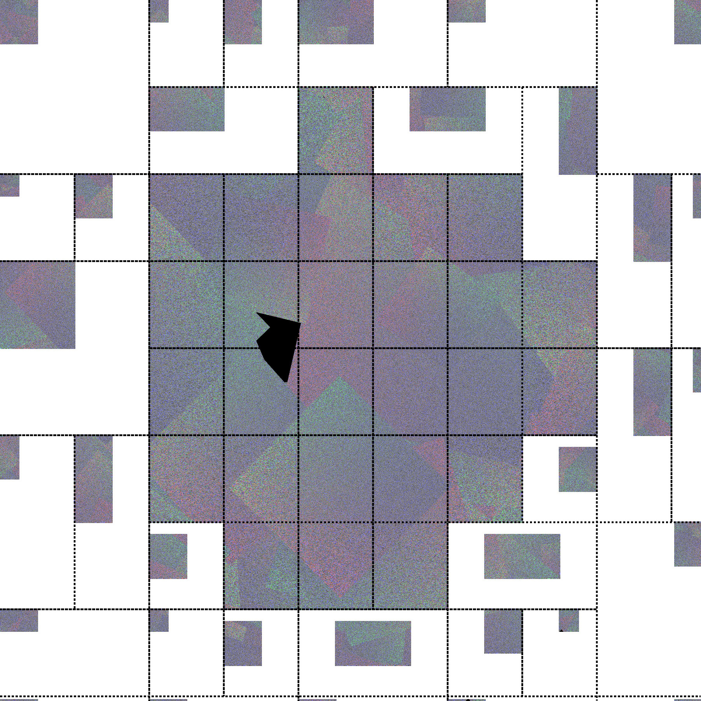
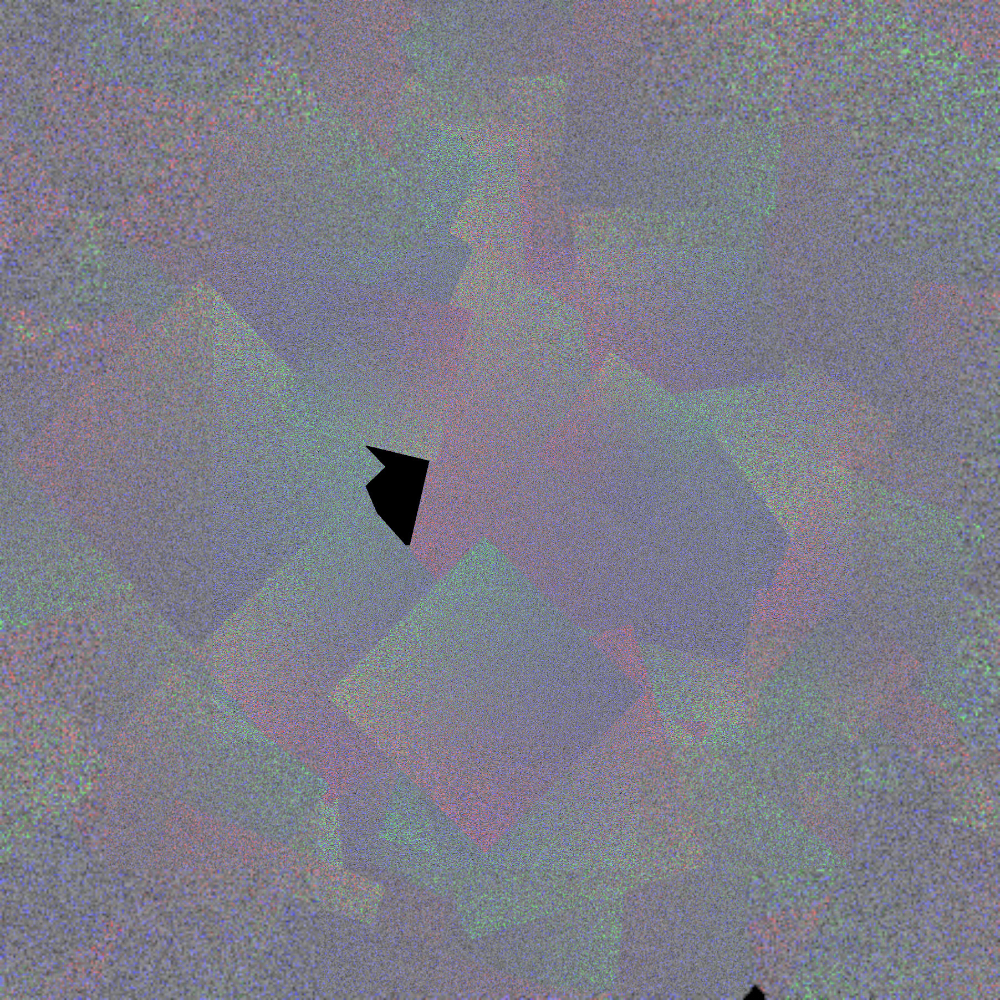

Fragment Density Map
====================

``VK_EXT_fragment_density_map`` is an extension which is intended to allow
users to render parts of the screen at a lower resolution. It is designed to be
implemented on tiled rendering GPU architectures such as Adreno, and the
intention is that it is implemented by rendering some of the tiles at a lower
resolution and scaling them up when resolving to system memory or when sampling
the resulting image. This inherently means that it is "all or nothing," that
is, it must be enabled or disabled for the entire render pass. While the idea is
simple, the implementation in turnip is very subtle with lots of
interactions with various different features. This page attempts to document
the main principles behind the implementation.

Coordinate Space Soup
---------------------

In order to render a tile at lower resolution, we have to override the user's
viewport and scissor for each tile depending on the scaling factor provided by
the user. This becomes complicated fast, so let's start by defining a few
coordinate spaces that we'll have to work with.

Framebuffer space
^^^^^^^^^^^^^^^^^

This is the space of the final rendered image. From the user's perspective
everything is specified in this space, and fragments created by the rasterizer
appear to be larger than 1 pixel. But this is not what actually happens in the
hardware, it is a fiction created by the driver. The other spaces below are
what the hardware actually "sees".

GMEM Space
^^^^^^^^^^

This space exists whenever tiled rendering/GMEM is used, even without FDM. It
is the space used to access GMEM, with the origin at the upper left of the
tile. The hardware automatically transforms rendering space into GMEM space
whenever GMEM is accessed using the various ``*_WINDOW_OFFSET`` registers. The
origin of this space in rendering space, or the value of ``*_WINDOW_OFFSET``,
will be called :math:`b_{cs}`, the common bin start, for reasons that are
explained below. When using FDM, coordinates in this space must be multiplied
by the scaling factor :math:`s` derived from the fragment density map, or
equivalently divided by the fragment area (as defined by the Vulkan
specification), with the origin still at the upper left of the tile. For
example, if :math:`s_x = 1/2`, then the bin is half as wide as it would've been
without FDM and all coordinates in this space must be divided by 2.

Rendering space
^^^^^^^^^^^^^^^

This is the space in which the hardware rasterizer operates and produces
fragments. Normally this is the same as framebuffer space, but with FDM it is
not. We transform the viewport and scissor from framebuffer space to
rendering space by patching them per-tile in the driver and then when we
resolve the tile we scale the resulting tile back to the correct resolution by
blitting from the rendering space source to the framebuffer space destination.

In order to come up with the correct transform from framebuffer space to
rendering space, it has to shrink the coordinates by :math:`s` while
mapping the original bin start in framebuffer space :math:`b_s` to
:math:`b_{cs}`. Since :math:`b_{cs}` is entirely defined by the driver when
programming ``*_WINDOW_OFFSET``, one tempting way to do this is to just
multiply by :math:`s` and define :math:`b_{cs} = b_s * s`. It turns out,
however, that this doesn't work. A key requirement is to handle cases where the
same scene is rendered in multiple different views at the same time using
``VK_KHR_multiview``, as in VR use-cases, and in this case we want :math:`s` to
vary per view, but :math:`b_{cs}` is always the same for every view because
there is only one ``*_WINDOW_OFFSET`` register for all layers (hence the name).

We follow the blob by leaving :math:`b_{cs}` the same regardless of whether FDM
is enabled or not. This means that normally :math:`b_s = b_{cs}`, although this
is not the case if ``VK_EXT_fragment_density_map_offset`` is in use and the
bins are shifted per-view. Since the coordinates need to be scaled by :math:`s`,
we know that the transform needs to look like :math:`x' = s * x + o`, where
only the offset :math:`o` is free. Plugging in the constraint that :math:`b_s`
maps to :math:`b_{cs}`, we get that :math:`b_{cs} = s * b_s + o` or
:math:`o = b_{cs} - s * b_s`. This is the function computed by
``tu_fdm_per_bin_offset`` and used to calculate the transform for the viewport,
scissor, and ``gl_FragCoord``. One critical thing is that the offset must be an
integer, or in other words the framebuffer space bin start :math:`b_s` must be
a multiple of :math:`1 / s`.  This is a natural constraint anyway, because if
it wasn't the case then the bin would start in the middle of a fragment which
isn't possible to handle correctly.

Subsampled Space
^^^^^^^^^^^^^^^^

When using subsampled images, this is the space where the bin is stored in the
underlying subsampled image. When sampling from a subsampled image, the driver
inserts shader code to transform from framebuffer space to subsampled space
using metadata written when rendering to the image.

Accesses towards the edge of a bin may partially bleed into its neighboring bin
with linear or bicubic sampling. If its neighbor has a different scale or isn't
adjacent in subsampled space, we will sample the incorrect data or empty space
and return a corrupted result. In order to handle this, we need to insert an
"apron" around problematic edges and corners. This is done by blitting from the
nearest neighbor of each bin after the renderpass.

Subsampled space is normally scaled down similar to rendering space, which is
the point of subsampled images in the first place, but the origin of the bin
is up to the driver. The driver chooses the origin of each bin when rendering a
given render pass and then encodes it in the metadata used when sampling the
image. Bins that require an apron must be far enough away from each other that
their aprons don't intersect, and all of the bins must be contained within the
underlying image.

Even when subsampled images are in use, not all bins may be subsampled. For
example, there may not be enough space to insert aprons around every bin. When
this is the case, subsampled space is not scaled like rendering space, that is
we expand the bin when resolving similar to non-subsampled images, however the
origin of the bin may still differ from framebuffer space origin.

The algorithm used by turnip used to calculate the bin layout in subsampled
space is to start with a "default" layout of the bins and then recursively
solve conflicts caused by bins whose aprons are too close together. The first
strategy used is to shift one of the bins over by a certain amount. The second
fallback strategy is to un-subsample both neighboring bins, making them
expanded so that they touch each other and there is no apron.

One natural choice for the "default" layout is to just use rendering space.
That is, start each bin at :math:`b_cs` by default. That mostly works, except
for two problems. The first is easier to solve, and has to do with the border
when sampling: it is allowed to use border colors with subsampled images, and
when that happens and the framebuffer covers the entire image, it is expected
that sampling around the edge correctly blends the border color and the edge
pixel. In order for that to happen, bins that touch or intersect the edge of
the framebuffer in framebuffer space have to be shifted over so that their edge
touches the framebuffer edge in subsampled space too.

Doing this also allows an optimization: because we are storing the tile's
contents one to one from GMEM to system memory instead of scaling it up, we can
use the dedicated resolve engine instead of GRAS to resolve the tile to system
memory. Normally GRAS has to be used with non-subsampled images to scale up the
bin when resolving. However this doesn't work for tiles around the right and
bottom edge where we have to shift over the tile to align to the edge. This
also gets a bit tricky when the tile is shifted to avoid apron conflicts, because
normally the resolve engine would write the tile directly without shifting.
However there is a trick we can use to avoid falling back to GRAS: by
overriding ``RB_RESOLVE_WINDOW_OFFSET``, we can effectively apply an offset by
telling the resolve engine that the tile was rendered somewhere else. This
means that the shift amount has to be aligned to the alignment of
``RB_RESOLVE_WINDOW_OFFSET``, which is ``tile_align_*`` in the device info.

The other problem with making subsampled space equal rendering space is that
with an FDM offset, rendering space can be arbitrarily larger than framebuffer
space, and we may overflow the attachments by up to the size of a tile. The API
is designed to allow the driver to allocate extra slop space in the image in
this case, because there are image create flags for subsampled and FDM offset,
however the maximum tile size is far too large and images would take up
far too much memory if we allocated enough slop space for the largest
possible tile. An alternative is to use a hybrid of framebuffer space and
rendering space: shift over the tiles by :math:`b_o` so that their origin
is :math:`b_s` instead of :math:`b_cs`, but leave them scaled down. This
requires no slop space whatsoever, because the bins are shifted inside the
original image, but we can no longer use the resolve engine as the tile offsets
are no longer aligned to ``tile_align_*``. So in the driver we combine both
approaches: we calculate an aligned offset :math:`b_o'` which is :math:`b_o`
aligned down to ``tile_align_*`` and shift over the tiles by subtracting
:math:`b_o'` instead of :math:`b_o`. This requires slop space, but only
:math:`b_o - b_o'` slop space is required, which must be less than
``tile_align_*``.  As usual the first row/column are not shifted over in x/y
respectively.

Here is an example of what a subsampled image looks like in memory, in this
case without any FDM offset:

Note how some of the bins are shifted over to make space for the apron. After
applying the coordinate transform when sampling, this is the final image:

When ``VK_EXT_custom_resolve`` and subsampled images are used together, the
custom resolve subpass writes directly to the subsampled image. This means that
it needs to use subsampled space instead of rendering space, which in practice
means replacing :math:`b_{cs}` with the origin of the bin in the subsampled
image.

Viewport and Scissor Patching
-----------------------------

In order to have :math:`s` differ per view, we have to be able to override the
viewport per view. That is, we need to transform the viewport for each view
differently. If there is only one viewport, then we duplicate the user's
viewport for each view and transform it using the :math:`b_s` and :math:`s` for
that view, and we set a "per-view viewport" bit to select the viewport per view
instead of using the default viewport 0. When
``VK_VALVE_fragment_density_map_layered`` is in use, we instead have to insert
shader code to achieve the same thing.

If the user specifies multiple viewports but they are per-view because
``VK_QCOM_multiview_per_view_viewport`` is enabled, then we can just set the
per-view viewport bit and transform each user viewport individually by the
corresponding scale. But if the user explicitly writes ``gl_ViewportIndex``,
then there is nothing we can do and we have to make :math:`s` the same for all
views by conservatively taking the minimum. Then we apply :math:`s` to all of
the user-specified viewports.

Because the bin size is now per-view, the usual mechanism of
``*_WINDOW_SCISSOR`` for clipping fragments outside the bin doesn't work.
Instead the driver needs to intersect the transformed user-specified scissor
with the transformed rendering-space bin coordinates, effectively replacing
``*_WINDOW_SCISSOR``.

Fragment density map offset
---------------------------

In order to "properly" implement ``VK_EXT_fragment_density_map_offset``, we
need to add an extra row/column of bins at the end and then shift the binning
grid up and to the left by an offset :math:`b_o`. This offset is based on the
user's offset but has the opposite sign, i.e. when shifting the FDM to the left
we have to shift the binning grid to the right, and once the user's offset
becomes large enough then we "wrap around" and shift over the scaling factor
:math:`s` to the next bin.  This has to happen per-view. In turnip the function
that computes :math:`b_o` is called ``tu_bin_offset``. Each tile then gets an
offseted start :math:`b_s = b_{cs} - b_o` except for the first row/column which
only shrink in height/width respectively.

If we cannot make :math:`s` per-view, then we also cannot make :math:`b_s`
per-view and so we cannot shift the bins over. Therefore we fall back to only
shifting where :math:`s` is sampled from, which produces jittery and jarring
transitions when a bin suddenly changes resolution.

Bin merging
-----------

FDM shrinks the size of the bin in GMEM, which results in a lot of wasteful
unused extra space in GMEM. a7xx mitigates this by introducing "bin merging".
If two tiles next to each other have the same scaling for each view, then we
combine them into one tile, as long as the combined size in rendering space
isn't larger than the original size of an unscaled bin in framebuffer space. We
can even merge larger groups of tiles. The only hardware feature needed for
this to work is the ability to merge the visibility streams for the tiles,
which was added on a7xx by a new bitmask in ``CP_SET_BIN_DATA5`` and variants.
Only bins within the same visibility stream/VSC pipe can be merged.

Hardware scaling registers and LRZ
----------------------------------

One disadvantage of FDM on a6xx is that low-resolution tiles cannot use
LRZ, because the LRZ hardware is not aware of the transform between framebuffer
space and rendering space and applies the framebuffer-space LRZ values to the
rendering-space fragments. In order to fix this, a740 adds new offset and scale
registers. The offset :math:`o'` is applied to fragment coordinates during
rasterization *after* LRZ, so that viewport, scissor, and LRZ are in a
new "LRZ space" while the other operations (resolves and unresolves, and
attachment writes) still happen in the rendering space which is now offset.
:math:`o'` is specified for each layer. The scale :math:`s` is the same as
before, and it is used to multiply the fragment area covered by each LRZ pixel.

Without ``VK_EXT_fragment_density_map_offset``, we can simply make LRZ space
equal to framebuffer space scaled down by :math:`s`. That is, we can set
:math:`o'` to what :math:`o` was before and then set :math:`o` to 0, only
scaling down the viewport but not shifting it and letting the hardware handle
the shift. Then LRZ pixels will be scaled up appropriately and everything will
work. However, this doesn't work if there is a bin offset :math:`b_o`. In order
to make binning work, we shift the viewport and scissor by :math:`b_o` when
binning. Unfortunately the offset registers do not have any effect when
binning, so rendering space and LRZ space have to be the same when binning, and
the visibility stream is generated from rendering space. This means that LRZ
space also has to be shifted over compared to framebuffer space, and the LRZ
buffer must be overallocated when FDM offset might be used with it (which is
signalled by ``VK_IMAGE_CREATE_FRAGMENT_DENSITY_MAP_OFFSET_BIT_EXT``) because
the LRZ image will be shifted by :math:`b_o`.

In order for LRZ to work, LRZ space when rendering must be equal to LRZ space
when binning scaled down by :math:`s`. The origin of LRZ space when binning is
:math:`-b_o`, and this must be mapped to 0. The transform from
framebuffer space to LRZ space is :math:`x' = x * s + o`, and the transform
from framebuffer space to rendering space is :math:`x'' = x * s + o + o'`.
We get that :math:`o + o' = b_{cs} - b_s * s`, similar to before, and
:math:`0 = -b_o * s + o` so that :math:`o = b_o * s` and finally
:math:`o' = b_{cs} - b_s * s - b_o * s`, or after rearranging
:math:`o' = b_{cs} - (b_s + b_o) * s`. For all tiles except those in the first
row or column, this simplifies to :math:`o' = b_{cs} - b_{cs} * s` because
:math:`b_{cs} = b_s + b_o`. For tiles in the first row or column, :math:`b_s`
and :math:`b_{cs}` are both 0 in one of the coordinates, so it becomes
:math:`o' = -b_o * s` in that coordinate. This isn't representable in hardware,
both because it is negative (which can be worked around by artifically
shifting :math:`b_{cs}`) but more importantly because it may not meet the
alignment requirements for the hardware register (which is currently 8 pixels).
We have to just disable LRZ in this case.
