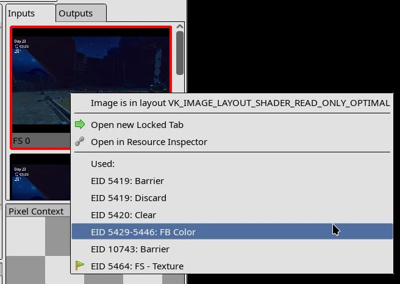
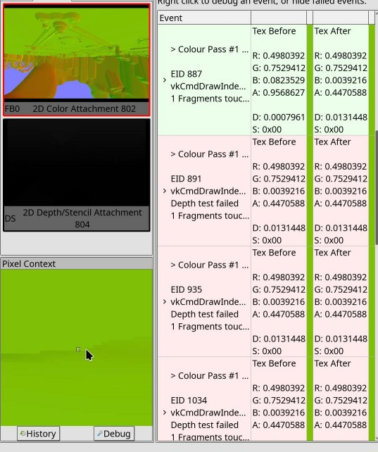
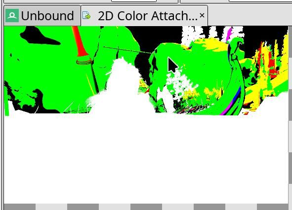

Debugging GPU hangs, faults, and misrenderings
==============================================

Preface
-------

For most GPU issues you encounter, you can do or think about the steps below, especially when you are unsure where to start. Several of these steps intersect when debugging different issues, and many of their ideas can be generalized.

There are references to certain debug capabilities that a driver can offer; the driver you are debugging may lack some of these. All capabilities mentioned here are extremely useful, so it's worth spending the time to add these features to your driver to improve the debugging experience.

For details on how to use specific debug features, refer to the driver's wiki pages.

Tools used for debugging
^^^^^^^^^^^^^^^^^^^^^^^^

* `RenderDoc <https://github.com/baldurk/renderdoc>`_ - a frame-capture-based graphics debugger. Supports Vulkan, D3D11, D3D12, OpenGL, and OpenGL ES.
* `GFXReconstruct <https://github.com/LunarG/gfxreconstruct>`_ - provides tools for the capture and replay of graphics API calls. Supports Vulkan and D3D12.
* `apitrace <https://github.com/apitrace/apitrace>`_ - provides tools for the capture and replay of graphics API calls. Supports OpenGL, D3D8, D3D9, and D3D11.
* `Amber <https://github.com/google/amber>`_ - Google's shader test framework.
* `vkrunner <https://gitlab.freedesktop.org/mesa/vkrunner>`_ - a Vulkan shader tester.
* `Piglit <https://gitlab.freedesktop.org/mesa/piglit>`_ - Mesa's test suite that includes shader runner.
* `Vulkan-ValidationLayers <https://github.com/KhronosGroup/Vulkan-ValidationLayers>`_ - Vulkan layers that verify the correctness of Vulkan usage.

Preliminary steps
-----------------

Estimate which component most likely causes the issue
^^^^^^^^^^^^^^^^^^^^^^^^^^^^^^^^^^^^^^^^^^^^^^^^^^^^^

* High chance of app issue:

  * Something someone recently wrote (e.g., translation layer update, new tests, etc.).
  * Some really weird game/app, especially if it directly uses Vulkan.

* High chance of driver issue:

  * Well-tested on other GPUs game/app.
  * Goes through DXVK or Zink translation layers.
  * Most misrenderings.

If you suspect that it is an app issue, you should use Khronos Validation Layers. Also, don't forget that certain validation features need to be explicitly enabled, like `GPU-assisted validation <https://vulkan.lunarg.com/doc/view/latest/windows/gpu_validation.html>`_.

You can also run the app with a ``debugoptimized`` build of the driver (build it with ``--buildtype=debugoptimized``\ ) to see if it triggers any asserts.

.. note::
   For any hang that is caused by a ``timeout``\ , you should check if increasing the timeout threshold to a higher value resolves the hang. It maybe possible to indetify whether the hang is caused by a timeout by looking at the dmesg output.

Driver on-CPU crashes and CPU-side undefined behavior
^^^^^^^^^^^^^^^^^^^^^^^^^^^^^^^^^^^^^^^^^^^^^^^^^^^^^

Almost any kind of issue may be caused by undefined behavior on CPU. Functionality without much testing, new code, and explicit CPU-side crashes are mostly the cases when you should be suspicious of undefined behavior.

* Use valgrind for memory issues and threading bugs.
* Use ubsan (\ ``-Db_sanitize=undefined`` build option) to find undefined behavior. Though there are some parts of Mesa that produce ubsan errors but work correctly (fixes are still welcome).
* ``-Db_sanitize=thread`` to check threading issues.
* There are other sanitizers, but they are less useful.

Did it work on an older driver version?
^^^^^^^^^^^^^^^^^^^^^^^^^^^^^^^^^^^^^^^

As well as the similar question of "Did it work with an older translation layer?"

If you know that the app was working on an older driver/translation, or you suspect that it was likely working, it can help to bisect the driver or translation layer to narrow down the cause of the issue.

You can use `git bisect <https://git-scm.com/docs/git-bisect>`_ with a known good commit hash and a bad commit hash to easily bisect the change history and find the problematic commit(s).

What kind of issue is it?
^^^^^^^^^^^^^^^^^^^^^^^^^

Is it a GPU memory access fault? Is it a GPU hang? Is it an unrecoverable GPU hang (GPU doesn't recover, the machine may be completely locked or auto-rebooted)? Is it a misrendering?

E.g., memory access faults may lead to misrenderings, or hangs may be preceded by a memory access fault.

Is the issue consistently reproducible? Can you make it 100% reproducible?
^^^^^^^^^^^^^^^^^^^^^^^^^^^^^^^^^^^^^^^^^^^^^^^^^^^^^^^^^^^^^^^^^^^^^^^^^^

It's hard to work with random issues, so making the issue as reproducible as possible is a high priority.

For misrenderings, it's possible that on every run the misrendering presents itself differently. You should try to reproduce the issue such that only one specific misrendering is reproduced every time.

Tips to make the issue reproducible:

* Make a trace: gfxreconstruct, RenderDoc, apitrace, etc.
* Dump submission to the GPU (GPU-specific).

  * If you can capture the raw commands submitted to the gpu and replay them, then that eliminates out a whole pile of ways that API trace capture/replay can affect your issue.

* Use debug options to reduce variation between runs.

  * Remove any "random" runtime heuristics. E.g., enable ``d3d11.reproducibleCommandStream`` in DXVK.
  * Write garbage values or zeroes into uninitialized memory/registers (e.g., ``NVK_DEBUG=trash_memory`` in NVK,  ``TU_DEBUG_STALE_REGS_RANGE`` in Turnip).
  * Force synchronizations and cache flushes.
  * Force synchronizations in shaders.
  * Investigate other driver- or layer-specific ways you can make the issue reproducible.

If the issue is intermittent, try to increase its occurrence rate or make it occur more consistently.

The above tips may prevent the issue from occurring, take that as a possible hint for the cause of the issue.

Make the issue easier to work with (or how to make a capture)
^^^^^^^^^^^^^^^^^^^^^^^^^^^^^^^^^^^^^^^^^^^^^^^^^^^^^^^^^^^^^

This is connected to reproducibility, but slightly different. For example, if you have a hang happening only when running a game for 10 minutes, it may be 100% reproducible but nearly impossible to debug. It is also possible you know the specific place in a game where there is a misrendering, so the next step is to make the issue more easily reproducible.

* Any API trace is much better than none, though for standalone tests (like dEQP) it may not be necessary.
* For misrenderings you ideally need a RenderDoc or Apitrace capture (or anything else that allows inspection of individual draws); for hangs it's also better but not crucial.
* Smaller captures are easier to work with; consider reducing texture quality and game resolution. For multi-frame traces, also consider reducing FPS to a low number-MangoHud could be used for this.
* For GPU hangs, it is great to capture raw submissions that reproduce the hang when re-submitted.

.. list-table::
   :header-rows: 1

   * - Driver
     - How to get raw submission?
   * - Turnip/Freedreno
     - ``FD_RD_DUMP=combine,full``\ , can also be used combined with the ``trigger`` option. Alternatively use ``echo 1 > /sys/module/msm/parameters/rd_full`` + ``/sys/kernel/debug/dri/0/hangrd > submission.rd``

Making a trace (especially a RenderDoc one) that reproduces the issue may be tricky.

Common issues
~~~~~~~~~~~~~

* Unsupported feature; something goes wrong when capturing:

  * Make sure you are using AT LEAST the latest release (look at the tool's git, not at the distro's package) of the debug tool.

* I cannot even make a trace; the GPU crashes! See the "Can you prevent the issue from happening?" section.

  * If you manage to make a trace, now make sure it reproduces the same GPU crash as the app.

* Rendering issue disappears when captured by RenderDoc or other API tracing tooling:

  * Mostly happens with RenderDoc. Caused by additional synchronizations.
  * If it happens with RenderDoc, in most cases it points to synchronization issues between commands on GPU. Try driver-specific debug options that affect synchronization.
  * In other cases, it can be that replaying the trace doesn't fully utilize the GPU or changes something in undefined behavior that caused the issue.

* Trace is not replayable on another GPU due to feature mismatch:

  * For Vulkan, you can use Vulkan-Profiles to restrict features to the intersection of GPU features (see ``gen_profiles_file.py`` from Vulkan-Profiles).
  * For ``gfxreconstruct``\ , you likely want to replay traces with ``--sfa --swapchain virtual -m rebind --remove-unsupported``.
  * RenderDoc also wants compatible memory requirements for images/buffers. To achieve that, you can hack the driver and increase the alignment/size requirements while making a capture. Generic solution TBD.

* Making a trace is too slow (for multi-frame ones):

  * For gfxreconstruct, you may want to change the memory tracking mode (see ``GFXRECON_MEMORY_TRACKING_MODE``\ ).
  * Start tracing closer to the issue.
  * Reduce game quality, especially textures; reduce resolution.
  * Consider making the trace on another faster machine; any difference in GPU features can be mitigated via Vulkan-Profiles (you'd need to intersect GPU capabilities).

RenderDoc
~~~~~~~~~

Supports D3D11, D3D12, Vulkan, OpenGL.

D3D11/D3D12:

* Launching the app from the RenderDoc UI and triggering the capture
* `Global Process Hook <https://renderdoc.org/docs/window/capture_attach.html#global-process-hook>`_ - in cases when you cannot launch the app via RenderDoc's UI, e.g., when the app starts through some other executable.

Vulkan:

* Use ``ENABLE_VULKAN_RENDERDOC_CAPTURE=1`` envvar to enable capturing for the app; it doesn't require the RenderDoc GUI to be launched.

  * If you use a custom RenderDoc build or have downloaded it, you should install the layer from it with ``renderdoccmd vulkanlayer --register --system``

* Specifying capturing options is available only from the GUI.
* If the application was started with the RenderDoc layer enabled (you'd see a frame counter at the top left), you can attach to the application from the GUI: "File" -> "Attach to Running Instance".

Common issues:

* RenderDoc fails to capture the frame (takes too long, OOMs):

  * Reduce game quality, especially textures; reduce resolution.
  * Make a capture from a multi-frame trace (uses less memory than full game).
  * Making the capture on another GPU may not be easy due to memory requirements mismatch, which is not mitigated by Vulkan-Profiles.

* Hard to catch a specific frame with RenderDoc:

  * Make a multi-frame trace with, e.g., gfxreconstruct, then make a RenderDoc capture of the specific frame.

* RenderDoc cannot capture from gfxreconstruct due to extensions mismatch:

  * Use Vulkan-Profiles to restrict used features while capturing the gfxreconstruct trace. The Vulkan profile can be obtained by running ``ENABLE_VULKAN_RENDERDOC_CAPTURE=1 vulkaninfo -j=0``

* Capture portability between different GPUs and driver versions:

  * D3D11 and OpenGL captures are mostly portable between GPUs/drivers.
  * Vulkan captures are not; they require at least Vulkan Profiles and increased memory requirements for images/buffers during the capture.
  * D3D12 captures are not portable.

* A capture may have the issue baked in, e.g., if the previous frame wrote some wrong value into a buffer and RenderDoc captured it.
* RenderDoc may support fewer features than the underlying driver, so RenderDoc may mask some of them. This means that what you see in the capture may not be what really runs without RenderDoc attached. This is most relevant to Vulkan.

GFXReconstruct
~~~~~~~~~~~~~~

Supports Vulkan and D3D12.

* `Tracing Vulkan <https://github.com/LunarG/gfxreconstruct/blob/dev/USAGE_desktop_Vulkan.md>`_
* `Tracing D3D12 <https://github.com/LunarG/gfxreconstruct/blob/dev/USAGE_desktop_D3D12.md>`_
* `Tracing on Android <https://github.com/LunarG/gfxreconstruct/blob/dev/USAGE_android.md>`_

Tips:

* The default memory tracking mode may conflict with crash detection libraries; consider ``userfaultfd`` mode in such cases.
* ``GFXRECON_CAPTURE_FILE_FLUSH=true`` may be needed to capture a GPU hang.
* ``GFXRECON_CAPTURE_TRIGGER=`` can be used to start tracing at the moment you want; the same mechanism is used for trimming the trace.
* If the replaying environment is different from the capturing environment, you may want to add the following options when replaying:

  * For Vulkan: ``--sfa -m rebind --remove-unsupported --wsi xlib --deduplicate-device``

* ``gfxrecon-optimize`` can be used to reduce the trace size.

apitrace
~~~~~~~~

Supports D3D8, D3D9, D3D10, D3D11, OpenGL.

* Tracing D3D: https://github.com/doitsujin/dxvk/wiki/Using-Apitrace
* Tracing OpenGL: ``apitrace trace --api /path/to/application [args...]``

  * For more complex cases, see https://github.com/apitrace/apitrace/blob/master/docs/USAGE.markdown

Tips:

* qapitrace allows inspecting individual draw calls, but to a lesser extent than RenderDoc.

  * Allows editing shader sources, disabling API calls, and inspecting state.
  * Sometimes inspecting the call crashes it.

* apitrace has some trimming support, but each API has its own limitations, and some trimmers aren't merged.

Can you prevent the issue from happening?
^^^^^^^^^^^^^^^^^^^^^^^^^^^^^^^^^^^^^^^^^

Especially for hangs, it may be important to find a way to prevent them in order to make a capture. Or, in the general case, it is useful to narrow down the issue.

For hangs, preventing them would make it possible to make a trace.

* Driver debug options are your friends here (search sources for up to date debug options):

.. list-table::
   :header-rows: 1

   * - Driver
     - DBG Options
   * - RADV
     - :envvar:`RADV_DEBUG`, :envvar:`ACO_DEBUG`
   * - RadeonSI
     - :envvar:`AMD_DEBUG`
   * - ANV
     - :envvar:`ANV_DEBUG`, :envvar:`INTEL_DEBUG`
   * - Iris
     - :envvar:`INTEL_DEBUG`
   * - NVK
     - :envvar:`NVK_DEBUG`, :envvar:`NAK_DEBUG`
   * - Turnip
     - :envvar:`TU_DEBUG`, :envvar:`IR3_SHADER_DEBUG`
   * - Freedreno
     - :envvar:`FD_MESA_DEBUG`, :envvar:`IR3_SHADER_DEBUG`
   * - HK
     - :envvar:`ASAHI_MESA_DEBUG`, :envvar:`AGX_MESA_DEBUG`
   * - PANVK
     - ``PANVK_DEBUG``
   * - V3DV, V3D
     - ``V3D_DEBUG``
   * - PVR
     - :envvar:`PVR_DEBUG`, :envvar:`ROGUE_DEBUG`
   * - DXVK (non-Mesa)
     - ``DXVK_CONFIG``

* If debug options don't help, modify the driver:

  * Maybe disable some shader optimizations if you suspect they cause the issue.
  * Maybe try disabling certain draw calls or dispatches.

How to debug?
-------------

Generic
^^^^^^^

* Bisect if it is a regression.
* If you have some guess about the area of the issue:

  * Add more asserts around the place you suspect.
  * Disable various optimizations to narrow down the issue.

Best case - bisection helped
~~~~~~~~~~~~~~~~~~~~~~~~~~~~

In many cases it will be apparent what's wrong with the commit; however, it's far from always.

* You can compare decoded submissions **before** and **after** the bisected commit.

  * It may be worth reducing changes in the bisected commit to narrow down the issue.

* Otherwise, the bisected commit gives you a better idea regarding the cause of the issue, and you'll go faster through the steps described below.

.. warning::
   The bisected commit may expose rather than cause the issue; it may just create an environment suitable for an error from another place to appear. For example, improving performance may cause a synchronization issue to become visible.

Good case - disabling some shader optimization helped
~~~~~~~~~~~~~~~~~~~~~~~~~~~~~~~~~~~~~~~~~~~~~~~~~~~~~

If it's NIR optimization, use ``nir_shader_bisect.py`` to bisect the shader that caused the issue. Having a shader and an optimization that broke should be enough to find the cause of the failure.

If it's a backend optimization, use backend-specific bisection tooling. (For example, ``ir3_shader_bisect.py`` for ir3.)

Once you have a specific optimization that causes an issue in a specific shader, simply ``diff``\ ing the shader assembly with an without the optimization might give you a clue of what the issue could be. Then using a shader override tool could be used to gradually bring the faulting shader closer to the working one, until the problem disappears.

.. list-table::
   :header-rows: 1

   * - Driver
     - Debug Option
   * - SPIR-V level replacement
     - ``MESA_SPIRV_READ_PATH`` - :ref:`spirv_replacement`
   * - GLSL level replacement
     - ``MESA_SHADER_DUMP_PATH``, ``MESA_SHADER_READ_PATH`` - :ref:`replacement`
   * - Turnip, Freedreno
     - ``IR3_SHADER_OVERRIDE_PATH``
   * - ANV, Iris
     - ``INTEL_SHADER_ASM_READ_PATH``

To help with ``diff``\ ing, it can be useful to make sure codegen changes in some part of the shader don't have a huge impact on unrelated parts. This is obviously difficult in general, but if it is possible, it really pays off to make the compiler output as deterministic as possible. For example, IR3 used to have a dependency between register allocation of the preamble and the main shader, causing a change in preamble codegen to often have a huge impact on the (independent) main shader as well. Making sure this doesn't happen helped a lot in diffing.

Good case - some debug option helped
~~~~~~~~~~~~~~~~~~~~~~~~~~~~~~~~~~~~

* Try to narrow the cases when the debug option is applied with the goal of finding the specific call.

  * For shader debug options, it could be useful to add assembly macros together with shader overrides. For example, ir3 has ``@fullsync{start,end}`` to force full synchronization for a section of shader assembly.

* If you have a trace of the issue, you can try disabling the debug option before/after specific draw/dispatch/blit and bisect the command that way.

Good case - stale register values
~~~~~~~~~~~~~~~~~~~~~~~~~~~~~~~~~

Stale register values, or even stale memory, are not rare issues, and they tend to cause random misrenderings or GPU crashes. A simple way to flush them out is to write predictable values right before they are expected to be changed.

For registers there are several natural points to do so:

* At the start of a command buffer, since no state is expected to carry on from previous ones.
* Before renderpasses, which have a bit of state setup that can go wrong. While the Vulkan spec allows binding a pipeline outside of the renderpass, no one does that, so it should be OK to overwrite all pipeline-related registers just before a renderpass starts.
* Before blits and other commands that are expected to be unaffected by other state.

It's also useful to have a debug option to always invalidate all state before each draw and other commands.

.. list-table::
   :header-rows: 1

   * - Driver
     - Debug Option
   * - Turnip
     - ``TU_DEBUG_STALE_REGS_RANGE`` + ``TU_DEBUG_STALE_REGS_FLAGS``

Misrenderings
^^^^^^^^^^^^^

Ideally you need to find the exact command causing the misrendering. The easiest way to do that is to use a debug tool that allows you to inspect individual draw calls (e.g., RenderDoc, qapitrace).

Blog posts with step-by-step examples of how to debug misrenderings:

* https://blogs.igalia.com/dpiliaiev/turnips-in-the-wild-part-1/ - debugging TauCeti Benchmark and Genshin Impact
* https://blogs.igalia.com/dpiliaiev/turnips-in-the-wild-part-2/ - debugging Genshin Impact
* https://blogs.igalia.com/dpiliaiev/turnips-in-the-wild-part-3/ - debugging Psychonauts 2 and Injustice 2
* https://www.supergoodcode.com/the-doctor-is-in/ - debugging Portal 2
* https://media.ccc.de/v/xdc2021-6-dissecting_and_fixing_vulkan_rendering_issues_in_drivers_with_renderdoc - a presentation with video examples on how to use RenderDoc to investigate rendering issues.

They are likely to be helpful in contextualizing the steps described below.

Good case - you can inspect individual draws
~~~~~~~~~~~~~~~~~~~~~~~~~~~~~~~~~~~~~~~~~~~~

Trace back from the final image to the exact draw call that caused the issue.

For games, most of the frame is image post-processing and copying data from one image to another with small tweaks. For RenderDoc, finding the draw call may look like this:

* Go to the last draw and make sure the issue is present.
* Go to the "Inputs" tab, find the image with the issue.
* Right-click it and go to the commands that last updated this image.
* Repeat a few times.

After a few loops you'll land on a renderpass that likely caused the issue; then you can go through the draw calls and find which one went wrong. The same applies to dispatches or other commands.

A faster way to go through draw calls is using RenderDoc's pixel history (https://renderdoc.org/docs/how/how_inspect_pixel.html#pixel-history):

I'm not sure if what I see is the issue or not?
"""""""""""""""""""""""""""""""""""""""""""""""

Sometimes you look at the image and you're not sure if there is an issue; at best it may look like an abstract painting.

In cases like this it can be valuable to have a capture of the same frame made on another driver that does not have the misrendering, so you can cross-check the resulting image and see if the abstract art is intended.

I think I found the command?
""""""""""""""""""""""""""""

Ideally you should compare the inputs that go into this command with a capture opened on another driver known to work. For very complex draws or dispatches, it can be nearly impossible to compare inputs between different GPUs.

* If the game doesn't use compute for everything and the inputs into the draw call look correct, you likely found the bad draw call.
* If the game heavily relies on compute to fill vertex buffers and many other resources, it may be hard to tell.

While investigating the rendering command further, watch for the possibility that inputs are wrong.

Misrendering happens in random draw calls!
""""""""""""""""""""""""""""""""""""""""""

Try everything to make it stable first. If it's still random, there are a few tricks to try.

* You can use a Python script for RenderDoc to find the first flaky call: https://github.com/werman/rdc-flaky-draw-call-finder/
* If it's not too random and you're able to find the draw call that fails fairly regularly, inspect it.

I definitely found the problematic command!
"""""""""""""""""""""""""""""""""""""""""""

Great. Now it's time to determine if the issue is in the draw state or in some shader stage (and which one).

In many cases it can be self-evident, like if there are issues with depth testing-it's worth looking at depth/stencil state.

Take a look at the "Rasterizer" and "FB" pipeline states in RenderDoc. Do they have some weird combination of states? That can be a clue.

If it's not self-evident, at least take a brief look at the raw draw state set for this draw.

Good case - you found the draw call and the issue is in the draw state
~~~~~~~~~~~~~~~~~~~~~~~~~~~~~~~~~~~~~~~~~~~~~~~~~~~~~~~~~~~~~~~~~~~~~~

* Many issues with draw state are caused by stale values, so make sure everything is re-submitted for the draw call or renderpass.
* Look carefully through draw state for anything standing out.
* Try to modify suspicious draw state for that draw call.
* For complex cases you may need to make a standalone reproducer of the issue.

Good case - you found the draw call and the issue is with shaders
~~~~~~~~~~~~~~~~~~~~~~~~~~~~~~~~~~~~~~~~~~~~~~~~~~~~~~~~~~~~~~~~~

Here, having a capture of the same frame opened on another GPU that doesn't reproduce the misrendering may help a lot.

Which stage is it?
""""""""""""""""""

* Vertex explosion - the issue is in VS/TCS/TESS/GS stages.
* Some pixels rendered wrong - likely FS.
* Texture is misplaced - UVs could have gone wrong at any stage.

To be more certain, open the mesh inspection panel and eyeball the outputs. Do they look reasonable? Compare them to the outputs you see in the same frame opened on another GPU, if available.

You found the stage!
""""""""""""""""""""

Even if you guessed the stage wrong, no big deal; during the next steps you'll find out anyway.

* Eyeball the decompiled-to-GLSL shader. Does anything look funny?
* Eyeball the assembly.
* Use shader debug printf, which is supported by RenderDoc, to inspect values. Keep in mind that modifying a shader can modify the compilation result:

  * `Printf in a graphics debugger <https://docs.vulkan.org/samples/latest/samples/extensions/shader_debugprintf/README.html#_printf_in_a_graphics_debugger>`_
  * `Shader Messages <https://renderdoc.org/docs/window/shader_messages.html>`_

* Nothing? It's time to bisect the shader. Ideally you'd want to have the same frame opened on another driver/GPU where there is no issue.

  * Works best with fragment shaders, but can be used with others.
  * The core idea is to remove parts of the shader, using the color attachment (or varyings or printf) to visualize the variable you want to output.
  * If you have the same capture opened on another device without the issue, you can paste the reduced shader there and compare results.
  * If you cannot compare with the correct shader, rely more on educated guesses. Try visualizing some coords used for texturing, texturing results, some inputs, etc. Look for clearly wrong values, like NaNs. It's also worth checking UBOs, push constants, and varyings for correctness.

* Found something but not sure what's going on? For example, the NIR looks fine and the assembly seems fine, but you see that specific instruction(s) cause issues.

  * Use assembly-replacement tooling in your backend (e.g., ``IR3_SHADER_OVERRIDE_PATH``\ , ``INTEL_SHADER_ASM_READ_PATH``\ , etc.) to make changes directly in the assembly and see via color what's wrong with the instruction.

Still not clear what's going on?
""""""""""""""""""""""""""""""""

You may want to make a standalone reproducer of this draw call. `Amber <https://github.com/google/amber>`_ test framework may be helpful here. It takes a bit of time to set up the draw call, but it's easier than writing Vulkan code by hand. As an alternative there is also `vkrunner <https://gitlab.freedesktop.org/mesa/vkrunner>`_.

Bad case - you cannot inspect individual draw calls
~~~~~~~~~~~~~~~~~~~~~~~~~~~~~~~~~~~~~~~~~~~~~~~~~~~

* Go back to attempting to bisect the driver or translation layers if things worked before.
* Test with debug builds of the driver and translation layers.
* Try all debug features from the driver and translation layers.
* Disable various optimizations in the shader compiler and packet emission.
* Try again with validation layers.

All these strategies don't need to completely resolve the misrendering. If something you do changes how the misrendering presents itself, that can be a strong signal for the cause.

Still nothing? Try to narrow the issue to a specific draw call. This strategy only works with draw calls:

* Bisect draw calls via their parameters, e.g., if ``vertexCount > 10000`` then return. This way you may be able to narrow things down to a single draw call and then find it in the command dump.
* It's much easier with traces, but also possible in the game itself-just make it possible to change the condition at runtime.

Still nothing? Are you sure you haven't missed checking anything? Maybe go back and fix issues preventing you from making a single-frame capture, add more debug flags to the driver, or remove more optimizations.

Terrible case - you cannot even get a replayable trace of the issue
~~~~~~~~~~~~~~~~~~~~~~~~~~~~~~~~~~~~~~~~~~~~~~~~~~~~~~~~~~~~~~~~~~~

Similar to the above case, but more difficult. It may make sense to have things like "disable draw call if ``vertexCount > 10000``\ " configurable at runtime, so you can change the behavior when the misrendering becomes visible. This way you should hopefully be able to identify the draw call inside submission dumps.

GPU crash
^^^^^^^^^

As with misrenderings, you'd want to find the exact command that causes a GPU hang. Most tips for debugging misrenderings also apply to debugging hangs, with one big caveat: RenderDoc doesn't handle hangs well.

What kind of crash is it?
~~~~~~~~~~~~~~~~~~~~~~~~~

All kernel drivers print some basic info about GPU hangs and faults to ``dmesg``. The verbosity and accuracy may vary. At a very high level, GPU hangs can be categorized as:

* "HW block got invalid state and reported error" - there is a high chance it would be explicitly reported in dmesg;
* "HW block got wedged due to a bad state and then got hang-checked";
* "HW block just took too long to complete the workload and got hang-checked."

In many cases, it won't be possible to tell from the reported GPU crash what exactly happened. Most likely, the HW gets wedged and then hang-checked regardless of the underlying cause.

And from another perspective, there are:

* **"Recoverable GPU crashes"** - after the crash happens, the kernel kills the offending workload, resets the GPU context, and other workloads run as before.
* **"GPU is unrecoverable"** - the kernel, for some reason, cannot correctly reset the GPU, so it won't run any new workload.
* **"System is unrecoverable"** - not only can the GPU not be recovered, but nothing else works; the system is inaccessible and, in many cases, triggers an auto-reboot. Mostly happens to iGPUs.

While the GPU shouldn't crash in the first place (the user-space driver should be fixed), GPU recovery in the kernel should function correctly, and if it doesn't, an issue should be opened. In very rare cases, especially in "System is unrecoverable," the GPU crash can happen due to faulty firmware or even HW bugs.

.. warning::
   Not all GPU crashes are caused by the driver; applications not adhering to the specification or having undefined behavior can also cause a GPU to crash.

Get GPU devcoredump of the crash
~~~~~~~~~~~~~~~~~~~~~~~~~~~~~~~~

If your kernel driver generates a GPU coredump on GPU crash, get it and decode it. In a perfect world, a GPU devcoredump could tell exactly where the issue happened, but in practice GPUs are highly parallel devices with many queues and HW blocks that can be wedged, so in many cases a coredump would point somewhere after the command that actually crashed the GPU. However, it also may work, or at least give you an idea about the range of commands.

On the other hand, if you know what you are doing, devcoredumps can give you a lot of info about the issue, but they may require a lot of digging.

Get several devcoredumps, compare the crash sites, and if it always points to the same sites, that's a strong signal.

.. list-table::
   :header-rows: 1

   * - Driver
     - Docs
   * - Turnip, Freedreno
     - :ref:`freedreno-gpu-devcoredump`
   * - RADV
     - :ref:`radv-debug-hang`

Maybe it's possible to find the crashing command in RenderDoc?
~~~~~~~~~~~~~~~~~~~~~~~~~~~~~~~~~~~~~~~~~~~~~~~~~~~~~~~~~~~~~~

If debug options, disabling optimizations, or disabling specific draws/dispatches/blits helped prevent the GPU crash, it should be possible to make a capture. Then it should be possible to toggle debug options or commands at runtime so that the capture opens without the crash, but afterward the workaround is disabled and it's possible to go from the start of the capture forward to find the command that crashes.

Even if the above doesn't yield the crashing command, it's still useful to have a capture to create a reproducer later when you find the command via other means.

Get a replayable raw submission that crashes the GPU
~~~~~~~~~~~~~~~~~~~~~~~~~~~~~~~~~~~~~~~~~~~~~~~~~~~~

This may not be useful for small workloads that always reproduce the issue, like a specific dEQP test. It can be especially useful for a randomly reproduced crash when playing a game.

All this depends on whether it's possible to dump the raw submission sent to the GPU with all the GPU memory and be able to replay it.

The dumped submission doesn't or only randomly reproduces the crash
"""""""""""""""""""""""""""""""""""""""""""""""""""""""""""""""""""

This is highly likely due to synchronization issues either in the command processor or in shaders.

GPU crash doesn't always happen, but I got a crashing submission
""""""""""""""""""""""""""""""""""""""""""""""""""""""""""""""""

If running the original app doesn't always lead to a GPU crash, but the replayed submission always does, it could indicate a few different things:

* The app produces different commands on each run due to different inputs or other randomness.
* If the app is expected to produce the same commands (e.g., CTS or a trace), this may mean the driver produces different commands on each run, which can be the result of undefined behavior.

  * Capture submissions when the app doesn't crash the GPU and when it does; decode and compare submissions. If there are differences other than GPU addresses, they are the most likely candidates.

You may be lucky and have access to a GPU simulator, or some verifier, or debug bus
"""""""""""""""""""""""""""""""""""""""""""""""""""""""""""""""""""""""""""""""""""

Using a GPU simulator is the most surefire way to find the GPU crash cause, but it may be prohibitively slow or hard to access. In such a case, it may still be useful to follow the described steps and at least reduce the workload that will run in the simulator.

Making changes to the submission dump to bisect the cause
"""""""""""""""""""""""""""""""""""""""""""""""""""""""""

If there is a capability to replay submission dumps and to decode them, the next logical step is to be able to edit them by decoding dumps into compilable code, including editable shader assembly. This allows you to rapidly test theories on the cause of a GPU crash and to bisect the crashing command.

There are two caveats with this feature:

* Self-modifying commands may pose a challenge to editing, e.g., if the driver has to patch some GPU addresses into the command buffer by doing a memory write on GPU.
* The GPU shader assembly compiler has to be in good shape to be able to compile all the assembly back. (Though even without it, submission editing is useful.)

.. list-table::
   :header-rows: 1

   * - Driver
     - How
   * - Turnip
     - :ref:`rddecompiler <freedreno-editing-command-stream>`

How to dump the crashing submission?
""""""""""""""""""""""""""""""""""""

Mesa or the kernel driver may have the ability to dump raw command streams sent to the GPU plus the memory state at that time. The kernel may be able to dump the crashing command stream with memory at the moment of the crash, or it may be able to dump every submission with the memory. Mesa may also be able to dump every submission with the memory.

Dumping the crashing command stream from the kernel may be the easiest way to get a reproducible GPU crash.

.. warning::
   GPU memory in a crash dump reflects the memory at the crash time, which may lead to divergence of command stream execution from the original.

Dumping every raw command stream takes much more space and time but can give the exact copy of the command stream that crashed the GPU.

Debugging unrecoverable GPU crashes
~~~~~~~~~~~~~~~~~~~~~~~~~~~~~~~~~~~

This section is most useful for the "System is unrecoverable" case but can occasionally be useful for less severe ones.

Fortunately, on average, it is easier to reproduce than other cases. So try the following things first:

* Try to bisect the workload itself: reduce the test case, exit earlier when replaying a trace, etc.
* Do the above inside the driver: exit at a specific draw/dispatch/blit/etc.

Now, the above advice may not have helped or may take too much time. There is another way to find the crashing command, with assistance from the driver.

It's a common GPU debugging tactic to sprinkle breadcrumbs in the command buffers to find the last one executed after a GPU crash. Though, in this case, one cannot inspect anything after the GPU crash, so what if the GPU is synchronized with the CPU at each breadcrumb, so that there is no ambiguity about where the GPU execution stopped? (Well, there still will be a bit of ambiguity due to the asynchronous nature of the GPU, but not much.)

The proposed debugging utility (already implemented in Turnip in ``tu_cs_breadcrumbs.cc``\ ) does the following:

* Outside of the driver: increase the hangcheck timeout to a huge value.
* Emit a GPU<->CPU sync point at each significant packet, like draw/dispatch/blit/etc.
* Run a thread on the CPU that checks the breadcrumb value in memory; if a new one appears, print it and send it over the network; write back an ack value for the GPU to proceed.
* Optionally request user input at each breadcrumb (useful to be configurable; e.g., request explicit confirmation after the 10,000th breadcrumb).

Together with dumping the submissions, the above allows you to find the closest point to the unrecoverable crash. The option for explicit user acks is useful to get as close to the crash as possible, with one reason being that HW may noticeably crash only after a certain time after the crashing packet (yes, it happened a few times on Adreno HW).

.. list-table::
   :header-rows: 1

   * - Driver
     - Debug Option
   * - Turnip
     - ``TU_BREADCRUMBS``

